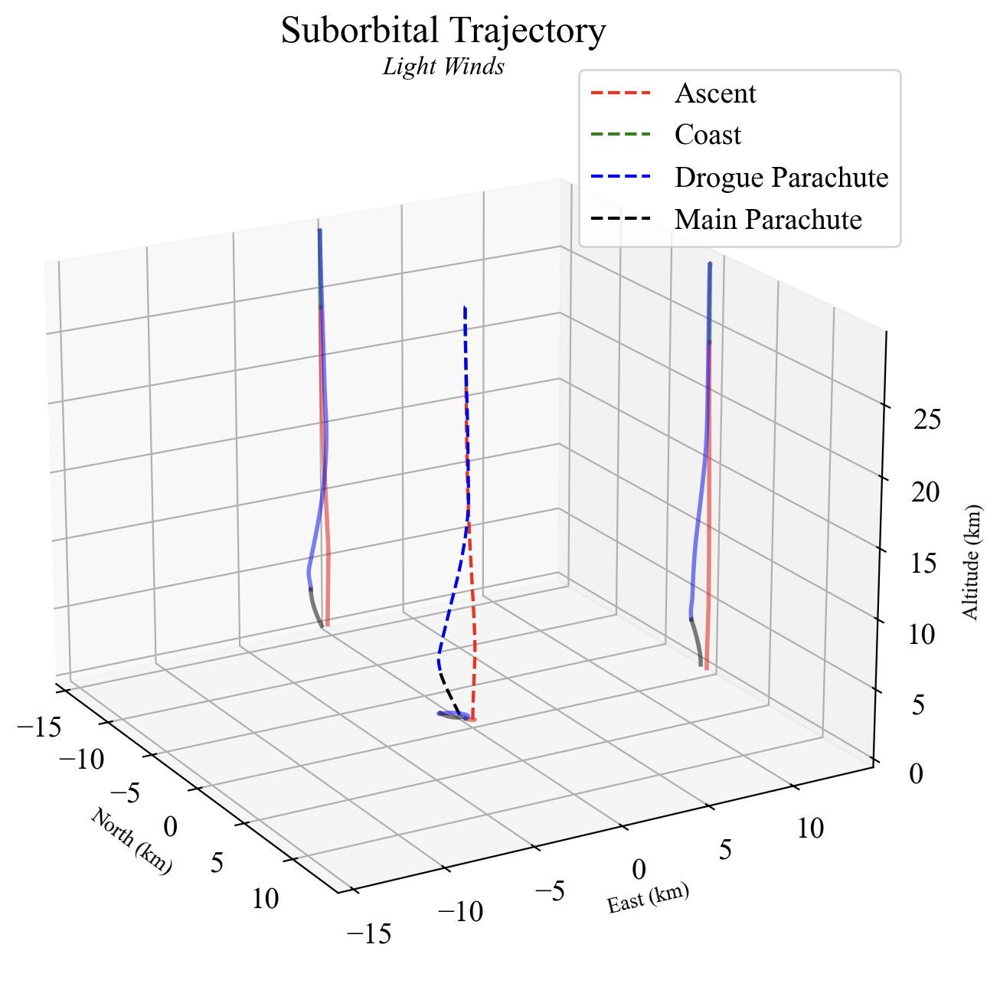
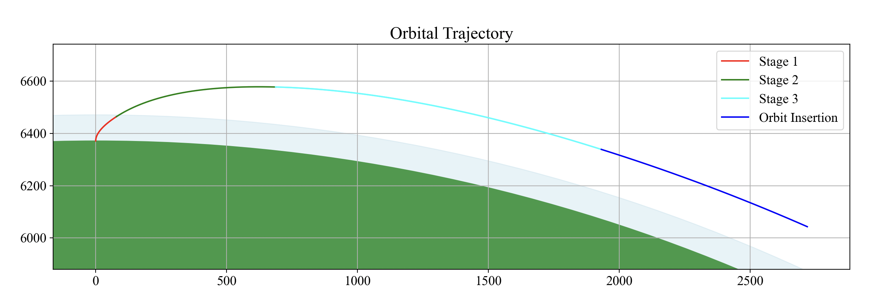

<p align="center">
  
</p>


<h1 align="center">Rockepy: User-Friendly flight-dynamics Toolkit</h1>

## Overview
Welcome to **Rockepy** – the python flight-dynamics toolkit designed with simplicity and approachability in mind. Whether you're a student taking your first steps in aerospace engineering, a researcher needing quick and reliable tools, or even an expert looking for an intuitive flight-dynamics library, Rockepy is here to guide you through the complexities of flight-dynamics.

## Vision
Rockepy aims to bridge the gap between advanced flight computations and ease of use. The core idea is to create a toolkit that "holds your hand", making it accessible to all, regardless of their prior expertise in the domain or in Python programming. The code is designed to be easy to use and easy to read, with no room for ambiguity.

## Current Development Status
Rockepy is continuously under active development, future updates will continue to incorporate a wide range of functionalities that are both comprehensive and easy to use. I am excited about the journey ahead and am committed to continually evolving and improving. 
### Highlight Features

- **Orbital Flight**: Rockepy empowers users to seamlessly design and execute missions aiming for orbit around the Earth. This feature set focuses on the initial launch phase, guiding rockets from the ground to a designated orbit. It includes tools for calculating trajectory, optimising fuel efficiency, and ensuring payload delivery to the correct orbital parameters. The toolkit simplifies complex calculations involved in achieving orbit, including stage separation dynamics, delta-v calculations, and the impact of atmospheric conditions on launch vehicles. Users can customise their mission parameters, such as launch site, target orbit, and payload mass, to accurately simulate and optimise their space missions.

- **Sub-Orbital Flight**: Tailored for missions that do not require orbit achievement, the Sub-Orbital Flight feature within Rockepy offers a detailed analysis of launch ascent trajectories, vehicle performance under atmospheric conditions, and recovery operations. It is ideal for sounding rockets, ballistic simulations, or any application requiring sub-orbital flight. This module allows for the exploration of various flight profiles, including the impact of drag coefficient, thrust-to-weight ratios, thrust performance during ascent and descent phases. Additionally, users can simulate the effects of different environmental conditions on the rocket's trajectory, ensuring a comprehensive understanding and planning of sub-orbital missions.

## A brief look at whats possible with Rockepy

#### Suborbital Launch Analysis
<p align="center">
  
  
</p>

_The profile of a suborbital launch in different weather conditions._

---

#### Orbtal Launch Analysis
<p align="center">
  
  
</p>

_A simpified and advanced profile of a staged orbital launch._

---

#### Orbit Propagation
<p align="center">
  
</p>

_Simulation of a satellite in low Earth orbit propagated over an extended period, demonstrating how the orbit evolves due to various forces._

---

#### Low Thrust Missions
<p align="center">
  
</p>

_Visualisation of a low thrust manoeuvre from a low to high Earth orbit._

---

#### Advanced Manoeuvres
<p align="center">
  
</p>

_Mission simulation of an aerobraking manoeuvre to further demonstrate the capabilities of Astronaupy._

---

### Get Started with Rockepy Tutorials
Learn how to use Rockepy efficiently through the concise tutorials. These guides cover everything from basic setup and simple orbit calculations to more complex simulations and analyses. Perfect for users of all skill levels, they provide clear, step-by-step examples that help you quickly master the toolkit's capabilities and produce results like those above and more.  

[Explore Rockepy Tutorials](https://github.com/hadleymcneill/Rockepy/tree/main/tutorials)

## Planned Features
- **Intuitive Interfaces**: User-friendly functions for common flight-dynamics calculations.
- **Step-by-Step Guidance**: Comprehensive documentation and examples to help users at every step.
- **Community Input**: Adapting and growing based on the feedback and needs of our user community.

## Get Involved
Head to the discussion to connect with other members of the community, I encourage you to:  
  
**Ask Questions** you’re wondering about.  
**Propose and Vote** on New Ideas for future development.  
**Share Validation Tests** to support the growth of Rockepy.

## Installation

To install Rockepy along with its dependencies, follow these steps:

1. **Clone the Repository**: Clone the Rockepy repository to your local machine.

```bash
git clone https://github.com/hadleymcneill/Rockepy.git
cd rockepy
```

2. **Set Up  Virtual Environment** (Optional but recommended): Before installing the dependencies, it's a good idea to create a virtual environment.

```bash
python3 -m venv venv
source venv/bin/activate  # On Windows, use `venv\Scripts\activate`
```

3. **Install Dependencies**: Rockepy relies on few external libraries to function correctly.

- **numpy**: Used for numerical computations.
- **scipy**: Used for optimisation.
- **matplotlib**: Used for basic visualisations.
- **pyvista**: Used for advanced visualisations

To install these dependencies, you can use pip:

```bash
pip install numpy scipy matplotlib pyvista

